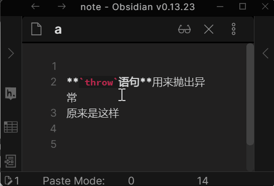

# Vim Multibyte Char Search

This is an obsidian plugin. It supports search multibyte characters in VIM easily. VIM is best to operate under english input mode, to search for multibyte characters like Chinese, users have to switch back and forth between input modes.

To simplify the process, this plugin allows users to search multibyte character by the first characters of corresponding input method encoding of the multibyte characters. 

For example, in the Chinese pinyin input method, the encoding of "用来" is "yong lai", we can search such chinese words by "yl".

# Usage

The plugin requires VIM mode being turned on in Obsidian. Then you can install this plugin by searching "obsidian-vim-multibyte-char-search" in Obsidian "Community Plugin" tab.

To achieve the best experience, it would be best to use "obsidian-vimrc-support" plugin and add following lines to the `.obsidian.vimrc`.
```
unmap <Space>
exmap enrich_vim_search_pattern obcommand obsidian-vim-multibyte-char-search:enrich-current-vim-search-pattern
nmap <Space>n :enrich_vim_search_pattern
```

Then the experience is like below
- Type "/yl" or "?yl"
- Press `<space> n n`
    - The first part of the key sequence is `<space> n`. According to our above configuration in `.obsidian.vimrc` , this key sequence will trigger command "Enrich Current VIM Search Pattern". The command retrieves current search pattern "yl", and tries to rewrite it according to all chinese phrases in current editor whose input method encoding starts from "yl". In this example, there are 2 chinese phrases "用来" and "原来", so the search pattern is rewritten to regular expression `用来|原来`.
    - Then the second `n` again to search using the new regular expression.
- Continue type "n" or "N" to jump to previous or next match, just as normal vim search.

.

# Onboard new language

The search capability is based on dictionary. "用来" is mapped to "yl" because following lines in `pinyin_search.dict.txt`.
```
用 y
来 l
```
The dictionary support multiple encoding for same character. For example, following lines mean "给" can start with either "g" or "j". so "给予" will match search pattern "gy" or "jy".
```
给 gj
予 y
```

To onboard any new language, just create a `pinying_search.dict.txt` for your language and replace the current one.

# Acknowledgement

The plugin is an Obsidian ported version of [GitHub - ppwwyyxx/vim-PinyinSearch: help vim search Chinese by Pinyin](https://github.com/ppwwyyxx/vim-PinyinSearch). ppwwyyxx generously allows me to use the same algorithm.

I learn how to work with CodeMirror editor from esm7's great plugin [esm7/obsidian-vimrc-support: A plugin for the Obsidian.md note-taking software](https://github.com/esm7/obsidian-vimrc-support). 
